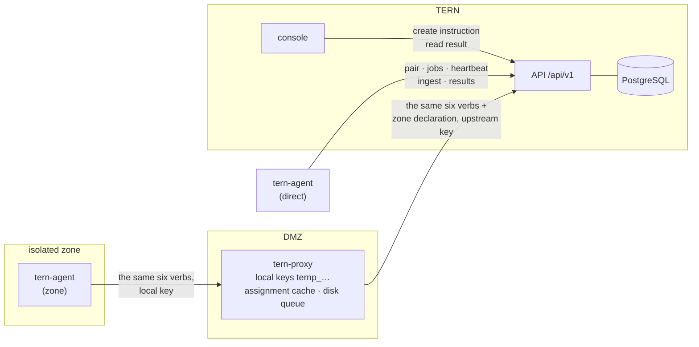
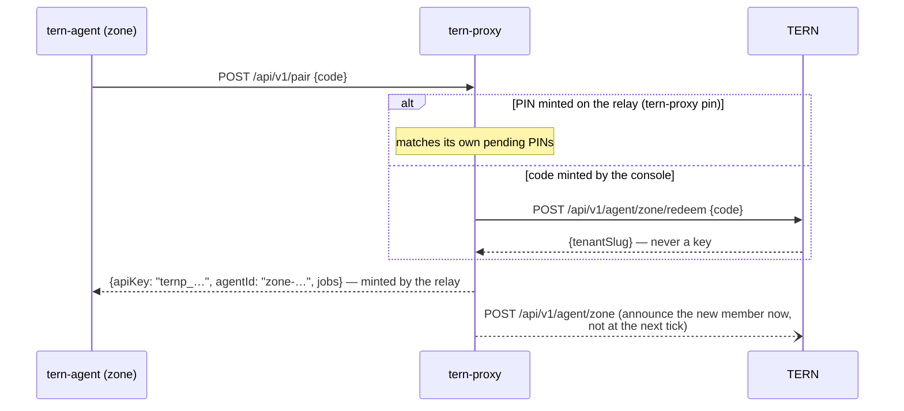
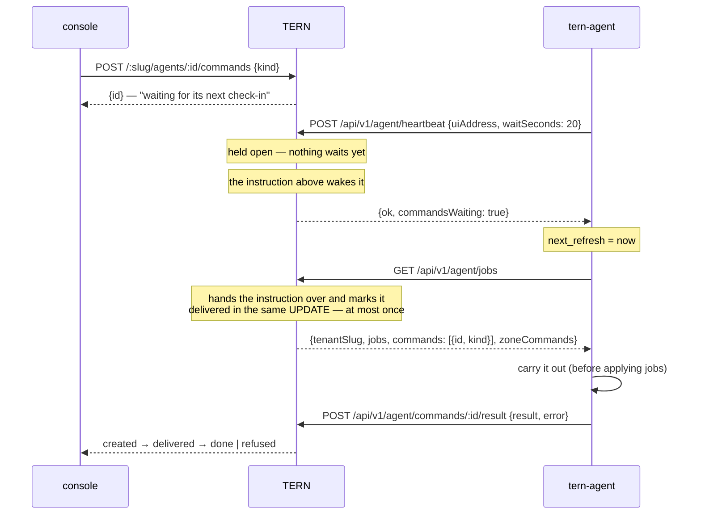
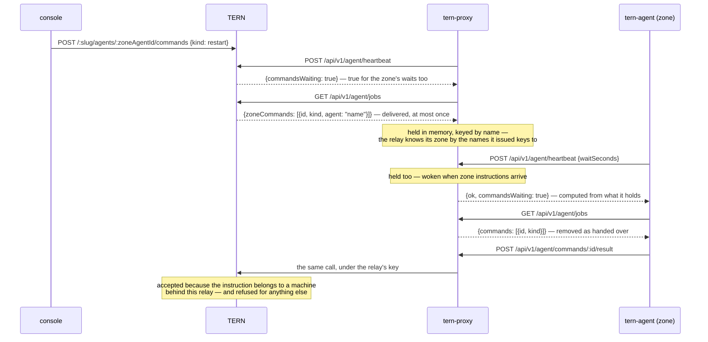

# The agent protocol

The contract between the server and its two Rust clients: `tern-agent` on a
monitored machine, and `tern-proxy` relaying for a zone with no route out.
This page is the narrative half; the exact request and response shapes live in
one place — `packages/shared/src/agent-protocol.ts` — and are exported as JSON
Schema under `schemas/agent-protocol/`, served rendered at `/api/v1/docs`, and
enforced against the Rust structs by the shared fixtures in
`schemas/conformance/protocol/`.

## The one rule everything follows from

**Nothing reaches an agent.** Agents poll; the server never dials out, and an
agent behind a relay has no route back at all. Every capability below —
assignments, instructions, liveness — is built as an answer to a request the
agent was already going to make.

## Version

Every exchange announces `X-Tern-Protocol: 1` and the server echoes it. There
is no negotiation: the fleet and the server are upgraded together, and a
mismatch answers `400` with code `protocol-mismatch`, naming both versions —
never a silent field-by-field guess. The header is required on `/api/v1/pair`
and `/api/v1/agent/*` (the callers are our binaries), and verified only if
present on `/api/v1/ingest` and `/api/v1/heartbeat/:controlKey`, whose promise
is that a bare `curl` works.

Conventions, fixed once:

- Envelopes are camelCase. The one exception is the _content_ of a job's
  `probe` and `assertions`, which stays snake_case because the agent reads the
  identical shape from `agent.toml` — TOML's convention — and a translation
  layer is a place for the two ends to disagree.
- Every timestamp is RFC 3339. The binaries always emit UTC (`…Z`);
  hand-written clients may send an offset.
- Success bodies are typed objects, never bare arrays.
- Every error body is an RFC 9457 problem document (below).

## The three channels



A zone agent is an ordinary agent whose `server =` points at the relay. The
relay serves the same routes with the same bodies, mints its own `ternp_` keys
(hashes only in `proxy.toml`), and speaks upstream under its own key — the
upstream credential never enters the zone. Refusals from the relay are the
same problem documents with the same codes, plus `upstream-unreachable` for
the one failure only a relay can have. Zones are one level deep: the relay
answers `zoneCommands: []` and there is no relay behind a relay.

## Pairing

```mermaid
sequenceDiagram
    participant A as tern-agent
    participant S as TERN
    participant C as console

    C->>S: POST /:slug/pairing-codes
    S-->>C: PIN + ready-to-paste command
    A->>S: POST /api/v1/pair {code, hostname, os, arch, agentVersion, installId}
    Note over S: claims the code in a conditional UPDATE<br/>(two agents, one single-use code: one winner)
    S-->>A: {apiKey, agentId, agentName, tenantSlug, jobs[]}
    Note over A: the key exists in clear exactly once, here.<br/>agent.toml gets server + api_key; probes come from jobs
```

Wrong, expired and spent codes all answer the same `401` — distinguishing them
would tell a guesser which codes exist. `installId`, generated by the agent
and kept in its config, is what lets a re-pairing machine replace its own row
instead of growing a twin. A relay pairs the same way, announcing
`proxy/<version>`; the prefix is how the server knows to expect a zone.

Behind a relay, the PIN can come from either side:



Either way the zone agent holds a key issued by the relay, valid at the relay,
worth nothing upstream — that is the property that keeps a zone safe, and why
redemption returns a tenant name and never a credential.

## The loop: heartbeat, poll, instructions

Two timers per agent: a beat every **60 s** (`HEARTBEAT_EVERY`) and an
assignment poll every **300 s** (`REFRESH_EVERY`), jittered up to 10 % so a
fleet paired from one script drifts apart. The beat is the cheap one, and it
carries the answer that collapses instruction latency — and it is now **held
open** rather than answered at once, which is what takes that latency from a
minute to a fraction of a second:



The instruction lifecycle is deliberately **at most once**: `deliveredAt` is
set as the poll reads it, not when the answer arrives, because a `restart` is
carried out by a process that then stops existing — still marked undelivered,
it would be handed over again on the way up and the machine would restart
twice. An answer may never come, and "asked, no answer" is a state the console
shows; it is not "refused". An agent that does not know a `kind` answers
`error: "this agent does not know the instruction …"` — the kind is a plain
string on the wire so an unknown one cannot break the poll that carries
everything else.

The kinds are one list, `AGENT_COMMAND_KINDS` in `@tern/shared`, feeding the
database enum, the route schema and the console: `pause`, `resume`, `stop`,
`restart`, `logs`, `ui-on`, `ui-off`. `stop` is final from the console on
purpose — a stopped agent polls nothing, so nothing is left to hear a resume;
the way back is `tern-agent resume` in a shell on the machine. `ui-on` answers
with the page password, hashed at rest on the machine: the reply is the only
moment it travels.

### The held beat

`waitSeconds` asks the server to keep the request open until there is something
to say. It is **asked for, never imposed**: a beat that omits it is answered
immediately, which is what every agent older than this does and what a
hand-written client will do. Three bounds, each for a different reason:

| Bound                   | Value | Why                                                                                                                                                                               |
| ----------------------- | ----- | --------------------------------------------------------------------------------------------------------------------------------------------------------------------------------- |
| Server hold             | 25 s  | Under the 30 s idle timeout of nginx and most load balancers, so the hold ends on TERN's terms rather than as a dropped connection an agent has to tell apart from a real failure |
| Agent request           | 20 s  | Under the agent's own 30 s HTTP timeout                                                                                                                                           |
| Relay hold for its zone | 20 s  | Sits _inside_ the relay's own wait — waiting longer than your relay does buys nothing                                                                                             |

The agent asks again the moment a held beat returns, which is what makes the
wait continuous. A reply that comes back **immediately** is read as "this server
does not hold" and the agent keeps its 60 s cadence — so a new agent against an
older TERN degrades to the old behaviour instead of hot-looping against it.

Why a held POST and not a WebSocket: the property that makes an agent reachable
at all is that the agent opens the connection. Through a firewall, through a
relay, through a corporate proxy that has never heard of an upgrade header — it
all works, because it is a POST that happens to take a while. A socket would buy
pushing things other than instructions, which nothing needs yet, at the cost of
a second protocol, a reconnection dance, and a fallback for the proxies that
refuse it.

The wake-up is **best effort, the database is the authority**: a beat held in
another process misses the in-process signal and ends on its own timer instead,
which costs a fraction of the hold rather than the instruction.

On `uiAddress`: `null` and _absent_ are different statements. `null` clears
the stored address ("no page, or loopback"); an absent field leaves it alone.
The agent always sends the field explicitly.

## Instructions for a zone



One bound worth knowing, and one that used to be. A zone instruction crosses
two hops, and each of them holds its beat — so the floor is two round trips
rather than two beat intervals. Measured on the bench, console to a machine with
no route back to the server at all: **0.30 s**, against 46 s before the hold.
The relay holds undelivered
zone instructions in memory only: a relay restarted before passing one on
loses it, and the console shows "asked, no answer" — the same promise as
everywhere else, chosen over a replay that could restart a machine twice.

## Measurements

`POST /api/v1/ingest` — one point or an array of up to 500, acknowledged with
individual rejections (`{accepted, rejected: [{controlKey, reason}]}`) so one
typo cannot discard a fleet's batch. Each point carries `ts`, stamped **when
it was measured**: the agent's disk queue (5 000 points, oldest evicted,
persisted on SIGTERM) replays after an outage with the history dated as it
happened, and the server clamps anything past +5 min / −7 days. The relay
acknowledges its zone's points immediately into its own queue and forwards in
chunks of 200 — blocking a zone on a WAN link that may be down is exactly
backwards.

`POST /api/v1/heartbeat/:controlKey` stays the zero-dependency path (`curl`
with a bearer key, optional `status`/`latencyMs`/`value`/`message` in the
query), answering `{accepted: 1, controlKey}` — a count, like `/ingest`.

## Errors

Every error body, from server and relay alike, is RFC 9457
`application/problem+json`:

```json
{
  "type": "https://tern.dev/problems/key-has-no-agent",
  "title": "Forbidden",
  "status": 403,
  "code": "key-has-no-agent",
  "detail": "This key is valid but no agent row holds it; only a paired agent may call this.",
  "instance": "/api/v1/agent/zone"
}
```

`code` is the field a program branches on; `title` and `detail` may be
reworded freely. Validation failures add `issues[]`, one entry per located
problem. The codes on the agent surface:

| `code`                 | Status  | Meaning                                                                   |
| ---------------------- | ------- | ------------------------------------------------------------------------- |
| `unauthorized`         | 401     | Missing, revoked or foreign key — re-pair the agent                       |
| `key-has-no-agent`     | 403     | The key is real but no agent row holds it (hand-minted keys, zone routes) |
| `forbidden`            | 403     | An ordinary agent using a relay-only verb                                 |
| `protocol-mismatch`    | 400     | The two ends speak different versions; both are named in `detail`         |
| `validation`           | 400     | The body failed the schema; see `issues[]`                                |
| `not-found`            | 404     | Unknown command id — or one that is not yours, indistinguishably          |
| `conflict`             | 409     | Instructing the instance's own local agent                                |
| `rate-limited`         | 429     | Over `INGEST_RATE_LIMIT_MAX` / `PAIR_RATE_LIMIT_MAX`                      |
| `upstream-unreachable` | 502/503 | Relay only: the zone did its part, TERN could not be reached              |

The one deliberate exception: `GET /api/v1/agent/jobs` with a valid key that
has no agent row **succeeds** with scope-derived jobs — a hand-minted key
running probes from a script is a feature, and it needs no fleet row.

The agent parses problem documents into typed errors, says what to do about a
401 in its log line, and **backs off exponentially** on repeated failures —
60 s doubling to 15 min, reset by the first success — instead of warning once
a minute forever. The pacing applies to every recurring upstream call: the
agent's heartbeat and ingest flush, and the relay's beat and forward loop.
Queued points keep accumulating (and persisting) during a hold, so backing
off costs freshness, never history.

## DEV mode

`TERN_PROTOCOL_TRACE=1` on either side (strictly `1`, like
`TERN_ALLOW_PLAIN_HTTP`), both to see one exchange from both ends:

- **Agent / relay**: one `debug` line per request and reply under the
  `protocol` tracing target, `Authorization` redacted. The lines land in the
  2 000-line ring buffer too, so the `logs` instruction and the local page can
  pull a trace from a machine nobody can shell into.
- **Server**: the same, under the `mod: "agent-protocol"` pino child logger —
  needs `LOG_LEVEL=debug`. Independent of it, delivery and results are logged
  at `info` (`instructions delivered` / `instruction answered`), rejected
  ingest points at `warn`, heartbeats at `debug`.

## Transport rules

- The agent refuses to send a key over plain HTTP unless the host is loopback
  — judged on the **parsed host** (`http://[::1]` is exempt,
  `http://localhost.evil.example` is not) — or `TERN_ALLOW_PLAIN_HTTP=1` is
  set, which the generated installers do for zones, where the relay serves
  plain HTTP on the LAN by design.
- `User-Agent: tern-agent/<version>` rides every request; the server stores it
  per agent for the fleet screen and never compares it. The protocol version
  is the header above, not the user agent.
- The download surface (`/api/v1/agent/releases`, `/api/v1/agent/bin/*`,
  `/install.sh`, `/install.ps1`) is public, versionless, and relayed verbatim
  into zones from a fixed path list — never from the request.
